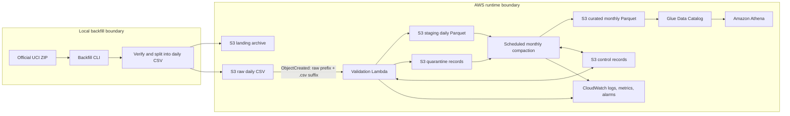

# MetroPulse: AWS Data Quality Pipeline

MetroPulse is a focused AWS data engineering portfolio project built around the real
[UCI MetroPT-3 dataset](https://archive.ics.uci.edu/dataset/791/metropt%2B3%2Bdataset).
The data contains 1,516,948 timestamped observations from 15 analogue and digital
signals on one metro train Air Production Unit (APU). It is operational train telemetry,
not manufacturing production-line data and not a table of confirmed failures.

The repository contains the Phase -1 feasibility study, Phase 0 architecture contracts,
the Phase 1 AWS-independent validation core, the Phase 2 local daily backfill, and the
Phase 3 offline-tested S3/Lambda adapter. It does not deploy or operate the AWS pipeline
described below.

## Proposed pipeline



The implementation deliberately uses Amazon S3, AWS Lambda, EventBridge Scheduler,
AWS Glue Data Catalog, Athena, CloudWatch, IAM, and Terraform. The monolithic source CSV
is split locally so each Lambda invocation handles one small, independently retryable
day. Valid rows become daily Snappy Parquet staging objects; invalid rows retain their
original data and rejection metadata in quarantine. Monthly compaction reduces about
212 daily units to roughly seven curated units partitioned by year and month.

Redshift, Kafka, Kinesis, Airflow, EMR, Spark, QuickSight, dbt, SageMaker, and machine
learning are outside this project's scope.

## Dataset facts and boundaries

- The source is CC BY 4.0, and UCI states that it contains no sensitive data.
- Source timestamps are timezone-naive. MetroPulse stores them as
  `event_timestamp_local` with timezone status `unknown`; it does not claim UTC.
- The observed cadence is approximately 0.1 Hz, mostly 10-second intervals, despite
  contradictory upstream 1 Hz wording. Significant collection gaps remain visible and
  are never imputed.
- The blank first source header maps to `record_index`. The source spelling
  `DV_eletric` is retained in lineage and maps to `dv_electric` downstream.
- Failure and maintenance windows are analytical reference intervals. They are not
  row-level labels and do not cause quarantine.
- Raw data, generated Parquet, artifacts, virtual environments, caches, and Terraform
  state are ignored by Git.

## Phase 1 core API

`metropulse.transform_daily_csv` accepts CSV text or a text-line stream plus an expected
source date, caller-supplied source metadata, processing time, and pipeline version. It
returns immutable typed collections of normalized records, quarantine records, batch
metrics, warnings/errors, and row-count reconciliation. The core performs no filesystem,
network, or AWS calls and never obtains the current time itself.

```python
from datetime import UTC, date, datetime

from metropulse import SourceMetadata, transform_daily_csv

result = transform_daily_csv(
    csv_text,
    expected_source_date=date(2020, 2, 1),
    source_metadata=SourceMetadata(source_object_key="raw/source_date=2020-02-01/day.csv"),
    processing_timestamp=datetime(2026, 9, 10, tzinfo=UTC),
    pipeline_version="1.0.0",
)
```

Run every offline test and quality check with:

```powershell
.\.venv\Scripts\python.exe -m ruff format --check .
.\.venv\Scripts\python.exe -m ruff check .
.\.venv\Scripts\python.exe -m pytest -q
```

## Phase 2 local backfill

The local-only backfill streams the verified UCI ZIP member, preserves the source CSV
header and values in daily raw files, calls `metropulse.transform_daily_csv` for each day,
and publishes explicit-schema Snappy Parquet plus a checksum manifest. It neither uses
AWS nor downloads data.

```powershell
.\.venv\Scripts\python.exe -m metropulse.backfill `
  --archive data\raw\metropt-3-dataset.zip `
  --output-root data\local-lake `
  --processing-timestamp 2026-09-10T00:00:00 `
  --pipeline-version 2.0.0
```

Generated files mirror future lake zones under the ignored `data/local-lake/` tree:

```text
raw/source=metropt3/source_date=YYYY-MM-DD/data.csv
staging/source=metropt3/year=YYYY/month=MM/day=DD/data.parquet
quarantine/source=metropt3/source_date=YYYY-MM-DD/rejected.jsonl
control/source=metropt3/source_date=YYYY-MM-DD/manifest.json
```

The verified full local run produced 212 raw CSV files, 212 staging Parquet files, and
212 manifests for 1,516,948 rows from 2020-02-01 through 2020-09-01. All rows validated,
so the actual quarantine result was zero files and zero rows. Independent inspection
reconciled raw rows = Parquet rows + quarantine rows, confirmed Snappy on every Parquet
file, confirmed the contracted timezone-naive schema, and found no absolute drive paths.
The first run took 146.150546 seconds. An identical second run verified all referenced
checksums and skipped all 212 days with processed/rebuilt/failed counts of zero.

Daily validation found 268 gaps greater than 60 seconds within daily objects. The global
continuity audit found another 63 gaps across adjacent object boundaries, giving the full
chronological total of 331 reported by Phase -1. Abnormal positive intervals similarly
reconcile as 306 within objects plus 63 at boundaries, or 369 globally. These audit
observations did not quarantine or impute rows.

Per-object validation cannot see the preceding or following object. The local global
audit owns cross-object continuity evidence; the future scheduled EventBridge audit job
will own that check in AWS. Run the same local audit with:

```powershell
.\.venv\Scripts\python.exe -m metropulse.global_audit `
  --output-root data\local-lake `
  --evidence artifacts\phase2-global-audit.json `
  --expected-global-gap-count 331
```

Resume skipped transformation for all 212 partitions, but integrity-first resume still
streams the source and hashes referenced raw, Parquet, and quarantine files. It proves
idempotency and corruption detection; it does not promise a dramatic wall-clock speedup.
See the
[local backfill operations guide](docs/local-backfill-operations.md) for recovery,
focused-date runs, forced rebuilds, and independent verification.

## Phase 3 S3/Lambda adapter

Phase 3 adds strict S3 `ObjectCreated` event parsing, deterministic daily output keys,
bounded object verification, conditional S3 claims and completion markers, stable JSON
logs, and CloudWatch Embedded Metric Format records. The handler is thin and all tests
use injected in-memory clients; no AWS calls or deployment occurred.

The offline real-day acceptance processed the median-sized generated raw partition for
2020-02-11: 7,431 input rows became 7,431 explicit-schema Snappy Parquet rows with zero
quarantine rows. A completion marker was published, the second invocation returned
`duplicate_skipped`, and the fake object contents remained byte-for-byte unchanged.

```powershell
.\.venv\Scripts\python.exe -m metropulse.aws.acceptance `
  --raw data\local-lake\raw\source=metropt3\source_date=2020-02-11\data.csv `
  --source-date 2020-02-11 `
  --pipeline-version 3.0.0 `
  --evidence artifacts\phase3-fake-s3-acceptance.json
```

See the [Lambda processing contract](docs/lambda-processing-contract.md) and
[observability contract](docs/observability.md). Lambda packaging and AWS infrastructure
remain Phase 4 decisions; this repository does not yet claim a deployable handler.

## Design documents

- [Architecture](docs/architecture.md)
- [Data contract](docs/data-contract.md)
- [Data-quality rules](docs/data-quality-rules.md)
- [Implementation plan](docs/implementation-plan.md)
- [Local backfill operations](docs/local-backfill-operations.md)
- [Lambda processing contract](docs/lambda-processing-contract.md)
- [Structured observability](docs/observability.md)
- Architecture decisions: [source ingestion](docs/adr/001-source-ingestion.md),
  [timestamp semantics](docs/adr/002-timestamp-semantics.md),
  [idempotency](docs/adr/003-idempotency.md),
  [small-file compaction](docs/adr/004-small-file-compaction.md), and
  [schema normalization](docs/adr/005-schema-normalization.md)
- Phase -1 evidence: [data source](docs/data-source.md) and
  [feasibility report](docs/feasibility-report.md)

## Reproduce Phase -1 profiling

Using Python 3.11 or newer and an already downloaded source archive:

```powershell
python -m venv .venv
.\.venv\Scripts\python.exe -m pip install ".[dev]"
.\.venv\Scripts\python.exe scripts\profile_dataset.py
.\.venv\Scripts\python.exe -m ruff format --check .
.\.venv\Scripts\python.exe -m ruff check .
.\.venv\Scripts\python.exe -m pytest -q
```

The download command is intentionally omitted here because the verified local dataset
already exists. The downloader remains reproducible and accepts only the official UCI
URL. Dataset provenance and the verified ZIP checksum are recorded in
[`docs/data-source.md`](docs/data-source.md).

## Dataset attribution

Davari, N., Veloso, B., Ribeiro, R., and Gama, J. (2021), *MetroPT-3 Dataset*,
UCI Machine Learning Repository, DOI
[10.24432/C5VW3R](https://doi.org/10.24432/C5VW3R). The dataset is licensed under
[CC BY 4.0](https://creativecommons.org/licenses/by/4.0/). The dataset files remain under
ignored `data/` paths and must not be committed.
