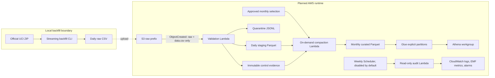

# MetroPulse: AWS Data Quality Pipeline

[](https://github.com/jingboli8/metropulse-aws-data-pipeline/actions/workflows/ci.yml)

MetroPulse is a portfolio data engineering project built around the real UCI MetroPT-3
Air Production Unit telemetry from a metro train. It demonstrates deterministic data
contracts, streaming backfill, row quarantine, explicit-schema Parquet, immutable
monthly publication, account-free AWS infrastructure tests, and operational auditing.
One row is one timestamped observation of all 15 sensor signals; it is not a confirmed
failure or defect event.

## Implementation status

| Capability | Status | Evidence boundary |
|---|---|---|
| Schema, validation, backfill, compaction, and audit cores | Implemented and locally tested | Synthetic tests plus sanitized full-data evidence |
| Lambda container for validation, compaction, and audit handlers | Externally container verified | User-run Linux amd64 build with deterministic smoke tests |
| S3, Lambda, Glue, Athena, Scheduler, CloudWatch, IAM, and ECR | Represented by Terraform and mocked tests | Definitions validated offline; no real service calls |
| AWS deployment | Not deployed to AWS | No real AWS API verification has occurred |
| GitHub Actions CI | Defined locally, awaiting first GitHub run | Badge becomes live only after push and a successful workflow |

## Architecture



The raw-only S3 notification prevents recursive invocation. MetroPT-3 is a closed
historical source ending on 2020-09-01, so compaction is on demand and requires an exact
immutable selection. The only recurring operation is a weekly full-checksum integrity
audit, represented by a schedule that defaults to disabled until curated publications
and an exact audit inventory exist. See the [architecture](docs/architecture.md) and
[static-source scheduling ADR](docs/adr/009-static-source-scheduled-operations.md).

## Verified results

The checked-in [sanitized evidence](docs/evidence/local-acceptance-summary.json) records
facts reproduced from ignored local acceptance outputs:

| Measure | Verified result |
|---|---:|
| Source observations | 1,516,948 |
| Daily inputs | 212 |
| Monthly curated outputs | 8 |
| Quarantined rows | 0 |
| Within-month gaps over 60 seconds | 327 |
| Cross-month gaps over 60 seconds | 4 |
| Full-history gaps over 60 seconds | 331 |

All rows reconciled. The eight monthly files have the exact 19-column schema,
timezone-naive `timestamp[ms]`, and Snappy on every column chunk. An identical run
preserved run IDs, logical manifests, and Parquet hashes in the pinned local runtime.
Missing 2020-02-29 and 2020-04-26 and the partial terminal month are coverage facts;
they are not fabricated rows or validation failures.

The external container check used Linux amd64, PyArrow 21.0.0, and the digest-pinned AWS
Lambda Python 3.12 base. It imported all three handlers, passed deterministic validation
and operations smoke tests, inspected 762 task entries, and verified default-user and
Docker-history safeguards. The local image size was 233,386,762 bytes (about 222.6 MiB).
This is packaging evidence, not deployment evidence. More context is in
[portfolio evidence](docs/portfolio-evidence.md).

## Data grain and quality model

The source contains a blank first header, a timezone-naive timestamp, and 15 signals.
The core normalizes the blank header to `record_index`, `timestamp` to
`event_timestamp_local`, and the source typo `DV_eletric` to `dv_electric` while
retaining source lineage. Timezone status remains `unknown`; the pipeline never labels
the timestamp as UTC.

Row errors cover structure, required values, parsing, finite analogue values, Boolean
domains, partition consistency, and within-object duplicates. Sampling gaps, missing
dates, negative finite values, and failure/maintenance windows do not quarantine valid
rows. Batch and monthly reconciliation must pass before completion is published. See the
[data contract](docs/data-contract.md) and [quality rules](docs/data-quality-rules.md).

## Quick start

Python 3.11 or 3.12 is supported. Unit tests use synthetic fixtures and require no data,
network, AWS account, or credentials.

```powershell
python -m venv .venv
.\.venv\Scripts\python.exe -m pip install -c requirements-ci.txt -e ".[dev]"
.\.venv\Scripts\python.exe -m ruff format --check .
.\.venv\Scripts\python.exe -m ruff check .
.\.venv\Scripts\python.exe -m pytest --strict-markers -m "not full_data"
```

The full dataset test is marked `full_data` and skips when the ignored local dataset is
absent. Dataset retrieval, checksum verification, daily backfill, resume, and recovery
commands are documented in [local backfill operations](docs/local-backfill-operations.md).
Generated CSV, ZIP, Parquet, manifests, artifacts, caches, virtual environments, and
Terraform state remain ignored.

## CI

The account-free GitHub Actions workflow tests Python 3.11 and 3.12, runs Ruff and
Markdown checks once, validates and mock-tests all four Terraform roots with Terraform
1.16.2, and parses tracked PowerShell scripts without executing them. Actions are pinned
to reviewed full commit SHAs, token permissions are read-only, and obsolete runs are
cancelled.

Here, “offline CI” means no AWS account, credentials, or API calls. Fresh GitHub runners
still download pinned actions, Python packages, Terraform, and the signed AWS provider
from their official distribution sources. CI does not run Docker, deployment, Terraform
plan, or Terraform apply.

## AWS deployment truth

The repository contains deployable design contracts and Terraform definitions, but it
is not deployed to AWS. Glue has no real catalog partition, Athena has executed no real
query, Scheduler has fired no real invocation, and no CloudWatch alarm, IAM role, ECR
repository, Lambda function, or S3 bucket has been verified through a real account.
Deployment and teardown remain an optional Phase 9 requiring separate authorization.
The [deployment runbook](docs/deployment.md) describes the intended ordering without
claiming that it has been executed.

## Cost and security

The design uses private encrypted buckets, Block Public Access, TLS-only policies,
least-privilege roles, immutable digest-pinned images, bounded Lambda resources, finite
log and temporary-data retention, a 256 MiB Athena per-query cutoff, and a disabled
schedule by default. There is no VPC, NAT Gateway, provisioned concurrency, or
always-running compute. Review [security](docs/security.md) and
[cost controls](docs/cost-control.md) before any optional deployment; no exact future
price is claimed.

## Deeper documentation

- [Architecture and event flow](docs/architecture.md)
- [Implementation plan and phase boundaries](docs/implementation-plan.md)
- [Data contract](docs/data-contract.md)
- [Data-quality and reconciliation rules](docs/data-quality-rules.md)
- [Monthly compaction](docs/monthly-compaction.md)
- [Scheduled operations](docs/scheduled-operations.md)
- [Query layer and SQL contracts](docs/query-layer.md)
- [Observability](docs/observability.md)
- [Deployment and recovery](docs/deployment.md)
- [Architecture decision records](docs/adr/001-source-ingestion.md)
- [Data source and attribution](docs/data-source.md)
- [Feasibility report](docs/feasibility-report.md)

## License and dataset attribution

Repository code is available under the [MIT License](LICENSE), Copyright (c) 2026 Jingbo
Li. The dataset is a separate work: Davari, N., Veloso, B., Ribeiro, R., and Gama, J.
(2021), *MetroPT-3 Dataset*, UCI Machine Learning Repository,
[DOI 10.24432/C5VW3R](https://doi.org/10.24432/C5VW3R), licensed under
[CC BY 4.0](https://creativecommons.org/licenses/by/4.0/). Dataset files are not included
in this repository.
