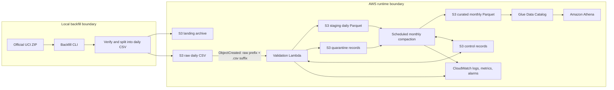

# MetroPulse: AWS Data Quality Pipeline

MetroPulse is a focused AWS data engineering portfolio project built around the real
[UCI MetroPT-3 dataset](https://archive.ics.uci.edu/dataset/791/metropt%2B3%2Bdataset).
The data contains 1,516,948 timestamped observations from 15 analogue and digital
signals on one metro train Air Production Unit (APU). It is operational train telemetry,
not manufacturing production-line data and not a table of confirmed failures.

The repository currently contains the completed Phase -1 feasibility study and Phase 0
architecture and engineering contracts. Phase 0 is documentation only: it makes no AWS
calls and creates no AWS resources.

## Proposed pipeline



The implementation deliberately uses Amazon S3, AWS Lambda, EventBridge Scheduler,
AWS Glue Data Catalog, Athena, CloudWatch, IAM, and Terraform. The monolithic source CSV
is split locally so each Lambda invocation handles one small, independently retryable
day. Valid rows become daily Snappy Parquet staging objects; invalid rows retain their
original data and rejection metadata in quarantine. Monthly compaction reduces about
212 daily units to roughly seven curated units partitioned by year and month.

Redshift, Kafka, Kinesis, Airflow, EMR, Spark, QuickSight, dbt, SageMaker, and machine
learning are outside this project's scope.

## Dataset facts and boundaries

- The source is CC BY 4.0, and UCI states that it contains no sensitive data.
- Source timestamps are timezone-naive. MetroPulse stores them as
  `event_timestamp_local` with timezone status `unknown`; it does not claim UTC.
- The observed cadence is approximately 0.1 Hz, mostly 10-second intervals, despite
  contradictory upstream 1 Hz wording. Significant collection gaps remain visible and
  are never imputed.
- The blank first source header maps to `record_index`. The source spelling
  `DV_eletric` is retained in lineage and maps to `dv_electric` downstream.
- Failure and maintenance windows are analytical reference intervals. They are not
  row-level labels and do not cause quarantine.
- Raw data, generated Parquet, artifacts, virtual environments, caches, and Terraform
  state are ignored by Git.

## Design documents

- [Architecture](docs/architecture.md)
- [Data contract](docs/data-contract.md)
- [Data-quality rules](docs/data-quality-rules.md)
- [Implementation plan](docs/implementation-plan.md)
- Architecture decisions: [source ingestion](docs/adr/001-source-ingestion.md),
  [timestamp semantics](docs/adr/002-timestamp-semantics.md),
  [idempotency](docs/adr/003-idempotency.md),
  [small-file compaction](docs/adr/004-small-file-compaction.md), and
  [schema normalization](docs/adr/005-schema-normalization.md)
- Phase -1 evidence: [data source](docs/data-source.md) and
  [feasibility report](docs/feasibility-report.md)

## Reproduce Phase -1 checks

Using Python 3.11 or newer and an already downloaded source archive:

```powershell
python -m venv .venv
.\.venv\Scripts\python.exe -m pip install ".[dev]"
.\.venv\Scripts\python.exe scripts\profile_dataset.py
.\.venv\Scripts\python.exe -m ruff format --check .
.\.venv\Scripts\python.exe -m ruff check .
.\.venv\Scripts\python.exe -m pytest -q
```

The download command is intentionally omitted here because the verified local dataset
already exists. The downloader remains reproducible and accepts only the official UCI
URL. Dataset provenance and the verified ZIP checksum are recorded in
[`docs/data-source.md`](docs/data-source.md).

## Dataset attribution

Davari, N., Veloso, B., Ribeiro, R., and Gama, J. (2021), *MetroPT-3 Dataset*,
UCI Machine Learning Repository, DOI
[10.24432/C5VW3R](https://doi.org/10.24432/C5VW3R). The dataset is licensed under
[CC BY 4.0](https://creativecommons.org/licenses/by/4.0/). The dataset files remain under
ignored `data/` paths and must not be committed.
