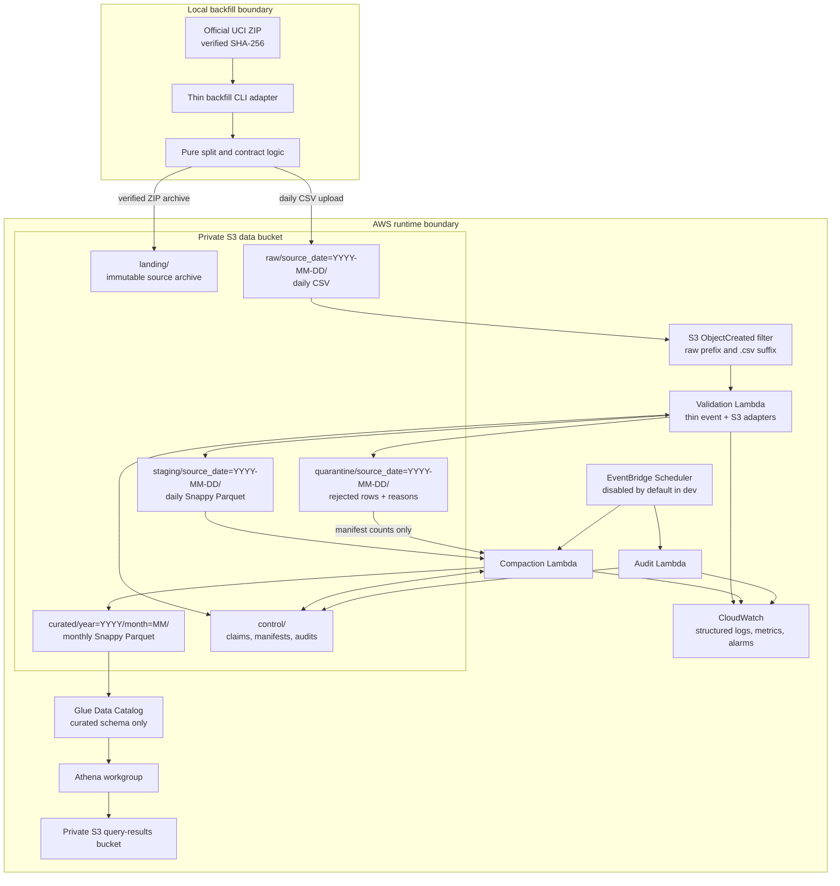

# Architecture

## Scope and principles

MetroPulse is a batch data-quality pipeline for the UCI MetroPT-3 Air Production Unit
telemetry. One source row is one timestamped observation of all 15 signals from one APU.
Rows are measurements, not confirmed failure or defect events. Failure and maintenance
windows remain separate analytical reference intervals.

The design optimizes for a clear junior-level portfolio: one bounded dataset, daily
validation units, monthly query files, infrastructure as code, and observable failure
modes. Business parsing, validation, normalization, and reconciliation functions accept
plain values and streams. They do not import `boto3`, read Lambda event objects, or make
network calls. Thin CLI, Lambda, and S3 adapters supply data to that core package.

## System diagram

The boundary is intentional. Only a human-run local CLI fetches the official source and
splits the 218 MB CSV. AWS receives an immutable archive for provenance and one raw CSV
per source date. AWS runtime code never downloads from UCI and no Lambda rescans the
monolithic source file.

Phase 3 implements and tests the validator's event, storage, idempotency, and
observability adapters using in-memory S3. Phase 4 adds the externally verified Linux
amd64 Lambda container definition and locally validated Terraform for ECR, private S3
storage, IAM, the log group, Lambda, and the raw-object notification. Nothing has been
deployed. Phase 5 adds offline Terraform contracts for the Glue database, curated table,
and Athena workgroup, but creates no partitions or AWS resources. The scheduled audit,
compactor, and approved curated partition publication remain later-phase architecture.

## Event and processing flow

1. The local CLI verifies the official ZIP against the recorded SHA-256, safely extracts
   it, streams the CSV, and groups rows by the derived `source_date`. It writes a source
   archive object and deterministic daily raw keys. A local-only mode supports testing
   without AWS.
2. The data bucket sends `ObjectCreated` events only for the `raw/` prefix and `.csv`
   suffix. Outputs use other prefixes and suffixes, so staging, quarantine, control, and
   curated writes cannot recursively invoke validation.
3. The validation Lambda adapter extracts bucket, key, version ID, ETag, and available
   checksum from the event or S3 metadata. The S3 adapter opens the object. Pure core
   logic parses and validates the rows.
4. Valid rows are normalized into one daily Snappy Parquet staging object. Invalid rows
   go to a deterministic quarantine object with their original record, rule IDs, and
   lineage. A control manifest records counts, checksums, schema version, and completion.
5. EventBridge Scheduler invokes compaction monthly. The compactor reads completed daily
   manifests for the target month, creates monthly Snappy Parquet, checks reconciliation,
   then publishes the curated manifest and partition. It never appends to a Parquet file.
6. Glue exposes only `curated/`. Each year/month partition points explicitly to one
   approved immutable `run_id`; partition projection and automatic repair are disabled.
   Athena queries those partitions through a workgroup with scan limits and a separate
   encrypted query-results bucket. Until Phase 6 publishes partitions, the Phase 5 table
   is empty.
7. A scheduled audit checks expected daily/monthly manifests, reconciliation, and
   cross-object continuity by comparing ordered daily manifest endpoints. This audit,
   rather than an individual validation invocation, owns partition-boundary gap,
   overlap, reversed-boundary, and missing-date findings. All adapters emit structured
   logs; terminal metrics are emitted once where practical.

## Storage zones and ownership

| Zone | Example key | Writer | Readers | Retention intent |
|---|---|---|---|---|
| Landing/source archive | `landing/source=uci-metropt3/sha256=<digest>/metropt-3-dataset.zip` | Backfill CLI | Audit/operator | Long-lived immutable provenance copy |
| Raw | `raw/source=metropt3/source_date=2020-02-01/data.csv` | Backfill CLI | Validator, audit | Long-lived replay source; preserve daily CSV |
| Staging | `staging/source=metropt3/year=2020/month=02/day=01/input_id=<id>/data.parquet` | Validator | Compactor, audit | Temporary; expire after curated retention buffer |
| Curated | `curated/metropt3/year=2020/month=02/run_id=<id>/part-00000.snappy.parquet` | Compactor | Glue/Athena, audit | Query-ready retained data |
| Quarantine | `quarantine/source=metropt3/source_date=2020-02-01/input_id=<id>/rejected.jsonl` | Validator | Compactor reconciliation, audit/operator | Retain long enough to diagnose/reprocess |
| Control | `control/validation/input_id=<id>/completed.json` | Validator/compactor/auditor | Pipeline components, operator | Claims, immutable manifests, audit results |
| Athena results | `s3://<query-results-bucket>/<workgroup>/...` | Athena | Authorized analyst | Short lifecycle; isolated from data zones |

The local CLI owns landing and raw creation. The validator owns daily staging,
quarantine, and validation manifests. The compactor owns monthly curated objects and
compaction manifests. The auditor owns audit records. Glue and Athena have read access
only to curated data; Athena alone writes query results.

## Retry and failure behavior

S3 notifications are at-least-once. A validation input identity combines source
bucket/key, the best immutable object identity available (version ID, then checksum,
then ETag), and pipeline version. Deterministic keys and conditional S3 control markers
make duplicate delivery safe without DynamoDB.

A concurrent invocation must acquire a conditional claim. A verified completed marker
returns a duplicate success without publishing terminal row-count metrics; an active
claim fails retryably. A stale claim may be replaced only with an ETag precondition.
Outputs use
deterministic keys, so a retry replaces its own incomplete output rather than appending.
The completion marker is written only after staging/quarantine uploads and reconciliation
succeed. A retry after partial failure reconstructs both outputs and then completes.

Lambda asynchronous invocation and scheduled jobs use bounded retry attempts and event
age. CloudWatch alarms surface exhausted invocation failures, and the scheduled audit
detects stale claims, absent manifests, incomplete months, and missing scheduled output.
Versioned input or a changed pipeline version creates a new identity and a deliberate
new output path; it never silently replaces another version's published curated partition.

## Observability and operations

Every invocation logs JSON containing `pipeline_version`, `input_id` or `run_id`, source
object identity, source date/month, status, duration, and row counts. Logs exclude raw
records. Custom CloudWatch metrics include input, valid, quarantined, and output rows;
quarantine rate; rule counts; processing duration; gap counts; sampling-interval counts;
and reconciliation status. Attempt/failure metrics may count retries; terminal data
metrics are emitted only by the invocation that conditionally creates the completion
marker.

Alarms cover Lambda invocation failures, quarantine-rate spikes, reconciliation failures,
and a missing monthly completion marker after the schedule's grace period. Dashboards
and alarms use low-cardinality dimensions such as environment, job, and rule ID; object
keys and input IDs stay in logs to avoid costly metric cardinality.

## Security and cost controls

- S3 buckets are private with all Block Public Access settings enabled, bucket-owner
  enforced ownership, TLS-only bucket policies, and encryption at rest. Versioning is
  enabled where immutable replay and object identity require it.
- Separate least-privilege IAM roles scope validation, compaction, audit, Glue, and
  Athena access to their required actions and prefixes. Lambda roles cannot read AWS
  credentials or unrelated buckets.
- Athena uses an enforced workgroup, per-query scan limits, metrics, and isolated query
  results. Glue tables point only to curated data.
- Lifecycle policies expire staging data and query results after configurable periods;
  quarantine retention is longer and raw/landing retention protects replayability.
- Development schedules are disabled by default. Reserved concurrency and Lambda
  timeout/memory limits bound accidental spend. S3 request volume, Lambda duration,
  CloudWatch retention, and Athena bytes scanned are the main cost signals; exact future
  prices are deliberately not claimed.
- Terraform applies common tags such as `Project`, `Environment`, `ManagedBy`, and
  `Owner` to every taggable resource.

Future teardown starts by disabling schedules and verifying the exact development
account, Terraform workspace, and project-tagged resource inventory. It then reviews a
`terraform plan -destroy`, empties only the named project-owned versioned buckets if the
reviewed plan requires it, runs `terraform destroy`, and verifies that the Terraform
state and tagged-resource inventory are empty. State files and saved plans remain outside
Git. Production or shared resources are never inferred from a name or deleted by a broad
bucket/account cleanup command.

## Service boundary

The approved services are S3, Lambda, EventBridge Scheduler, Glue Data Catalog, Athena,
CloudWatch, and IAM, with Terraform defining resources incrementally. Redshift, Kafka,
Kinesis, Airflow, EMR, Spark,
QuickSight, dbt, SageMaker, and machine learning are explicitly out of scope.
