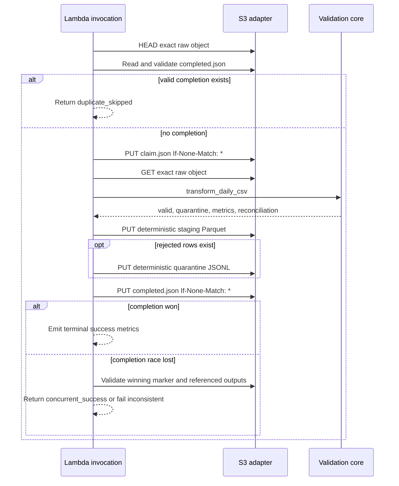

# Lambda processing contract

## Scope and entry points

Phase 3 implements an offline-tested adapter for one daily S3 raw object. The Lambda
entry point is `metropulse.aws.lambda_handler.lambda_handler`; the independently testable
orchestrator is `metropulse.aws.processor.ObjectProcessor.process`. Phase 4 defines the
container, IAM, event notification, and runtime configuration. The user-run Linux amd64
container verification passed; nothing has been deployed.

The handler parses each S3 record and delegates it. Schema parsing, row validation,
normalization, batch metrics, Parquet schema, and quarantine construction remain in the
AWS-independent core.

## Event and key contract

Only `aws:s3` records whose event name begins with `ObjectCreated:` are supported. Event
keys are decoded with S3 form semantics, including percent escapes and `+` for spaces.
After decoding, the key must exactly match:

```text
raw/source=<expected-source>/source_date=YYYY-MM-DD/data.csv
```

The adapter captures bucket, decoded key, version ID, ETag, size, sequencer, event time,
and partition date. The configured source name, raw prefix, and `.csv` suffix are checked
before any object read. ETag is an opaque change token and is never described as an MD5
digest.

For processing identity `<input-id>`, outputs are:

```text
staging/source=<source>/year=YYYY/month=MM/day=DD/input_id=<input-id>/data.parquet
quarantine/source=<source>/source_date=YYYY-MM-DD/input_id=<input-id>/rejected.jsonl
control/validation/input_id=<input-id>/claim.json
control/validation/input_id=<input-id>/completed.json
```

These prefixes cannot match the raw notification filter, preventing recursive
invocation. Source and destination buckets may differ.

## Identity and object verification

The input ID is a lowercase SHA-256 digest over canonical sorted JSON containing source
bucket, decoded key, the selected immutable object token, pipeline version, schema
version, and manifest version. The object token preference is version ID, then S3
SHA-256 checksum, then ETag. Available version, ETag, and computed raw SHA-256 remain in
lineage even when another token owns identity.

Before reading the body, the processor compares event size, ETag, and version ID with
object metadata and enforces `METROPULSE_MAXIMUM_INPUT_BYTES`. It requests the event's
specific version when supplied. Metadata is compared again after the body read; UTF-8
decoding is strict, and a supplied SHA-256 checksum must match the body. A replaced,
oversized, or undecodable object fails without publishing completion.

## Timestamp policy

The deterministic processing timestamp comes from the object's `LastModified` value,
normalized to UTC. Event time is the fallback when a storage implementation does not
supply `LastModified`. The same immutable object therefore produces the same Parquet
metadata, quarantine records, and completion manifest on retry. Source timestamps remain
timezone-naive `event_timestamp_local` values with status `unknown`.

The injected current-time clock is used only for operational claim expiry. It never
changes data outputs or source timestamp semantics.

## Completion and retry sequence



A claim is active for 16 minutes. An active claim makes the invocation fail retryably; a
stale claim can be replaced only with its current ETag. A crash before completion leaves
deterministic data objects unpublished and retryable. Recovery overwrites its own
incomplete Parquet or JSONL object; it never appends. Completion is immutable and is
created only after output checksum, size, and row reconciliation are known.

A completion marker is accepted only if its processing identity matches, daily counts
reconcile, each required output exists, its current byte count and calculated SHA-256
match the marker, and its stored checksum metadata agrees. File existence alone does not
prove completion. Zero quarantined rows produce no quarantine object or fake record.

## Multi-record behavior

Records in one notification are attempted independently in event order. Valid earlier
records can complete even when a later record fails. After every record is attempted,
any failure raises one deterministic `InvocationFailure` containing the successful
per-record results and bounded error summaries. Lambda can retry the invocation; earlier
successes then validate their marker and return `duplicate_skipped`.

## Configuration and offline procedure

The handler requires these non-secret environment variables:

| Variable | Purpose |
|---|---|
| `METROPULSE_EXPECTED_SOURCE_NAME` | Expected `source=` value. |
| `METROPULSE_RAW_PREFIX` | Accepted input prefix. |
| `METROPULSE_STAGING_PREFIX` | Daily Parquet output prefix. |
| `METROPULSE_QUARANTINE_PREFIX` | Rejected-row output prefix. |
| `METROPULSE_CONTROL_PREFIX` | Claim and completion prefix. |
| `METROPULSE_PIPELINE_VERSION` | Immutable processing version. |
| `METROPULSE_MAXIMUM_INPUT_BYTES` | Positive bounded input limit. |
| `METROPULSE_ENVIRONMENT` | Low-cardinality observability dimension. |
| `METROPULSE_DESTINATION_BUCKET` | Output bucket, independent of input bucket. |

Terraform defaults to a 25 MiB limit as a practical starting point: it leaves ample
headroom above the observed daily objects while remaining bounded. It pairs that limit
with 2,048 MiB memory, a five-minute timeout, and 1,024 MiB `/tmp`; all remain reviewed
deployment variables.

Run a local fake-S3 acceptance against an existing ignored daily partition:

```powershell
.\.venv\Scripts\python.exe -m metropulse.aws.acceptance `
  --raw data\local-lake\raw\source=metropt3\source_date=2020-02-11\data.csv `
  --source-date 2020-02-11 `
  --pipeline-version 3.0.0 `
  --evidence artifacts\phase3-fake-s3-acceptance.json
```

The command reads a local file and uses `InMemoryObjectStorage`; it makes no AWS or
network call. Detailed evidence remains ignored. The optional `aws` dependency group
documents boto3 for local adapter work. Lambda supplies the AWS SDK. ADR 006 selects a
digest-pinned Python 3.12 Linux amd64 container for PyArrow portability. The external
Docker verification passed, and no deployed-handler claim is made.
